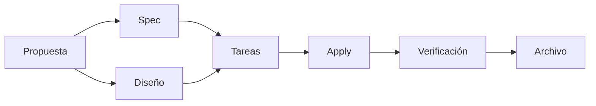

# Fases del flujo SDD

> Referencia rápida de cada fase: qué produce, qué consume y criterio de salida.

## Diagrama de dependencias

## Fases

### Propuesta
- **Consume**: brief del cliente
- **Produce**: alcance, objetivos, restricciones, no-goals
- **Criterio de salida**: equipo alineado en QUÉ se construye

### Spec
- **Consume**: propuesta aprobada
- **Produce**: requisitos funcionales y escenarios
- **Criterio de salida**: todos los casos cubiertos

### Diseño
- **Consume**: propuesta aprobada
- **Produce**: decisiones técnicas, arquitectura, componentes
- **Criterio de salida**: ninguna pregunta técnica abierta

### Tareas
- **Consume**: spec + diseño
- **Produce**: checklist ordenada e implementable
- **Criterio de salida**: cada tarea es atómica y verificable

### Apply
- **Consume**: tareas + spec + diseño
- **Produce**: código implementado, tareas marcadas
- **Criterio de salida**: todas las tareas completadas

### Verificación
- **Consume**: spec + tareas + apply-progress
- **Produce**: informe de verificación (CRITICAL / WARNING / SUGGESTION)
- **Criterio de salida**: sin CRITICAL abiertos

### Archivo
- **Consume**: todos los artefactos
- **Produce**: informe final archivado
- **Criterio de salida**: cambio cerrado y documentado
