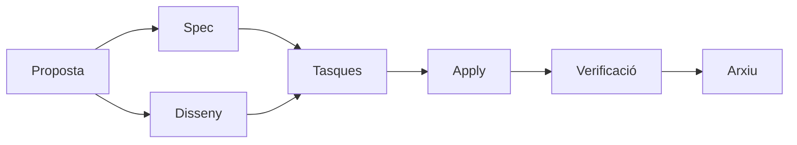

# Fases del flux SDD

> Referència ràpida de cada fase: què produeix, què consumeix i criteri de sortida.

## Diagrama de dependències

## Fases

### Proposta
- **Consumeix**: brief del client
- **Produeix**: abast, objectius, restriccions, no-goals
- **Criteri de sortida**: equip alineat en QUÈ es construeix

### Spec
- **Consumeix**: proposta aprovada
- **Produeix**: requisits funcionals i escenaris
- **Criteri de sortida**: tots els casos coberts

### Disseny
- **Consumeix**: proposta aprovada
- **Produeix**: decisions tècniques, arquitectura, components
- **Criteri de sortida**: cap pregunta tècnica oberta

### Tasques
- **Consumeix**: spec + disseny
- **Produeix**: checklist ordenada i implementable
- **Criteri de sortida**: cada tasca és atòmica i verificable

### Apply
- **Consumeix**: tasques + spec + disseny
- **Produeix**: codi implementat, tasques marcades
- **Criteri de sortida**: totes les tasques completades

### Verificació
- **Consumeix**: spec + tasques + apply-progress
- **Produeix**: informe de verificació (CRITICAL / WARNING / SUGGESTION)
- **Criteri de sortida**: sense CRITICAL oberts

### Arxiu
- **Consumeix**: tots els artefactes
- **Produeix**: informe final arxivat
- **Criteri de sortida**: canvi tancat i documentat
