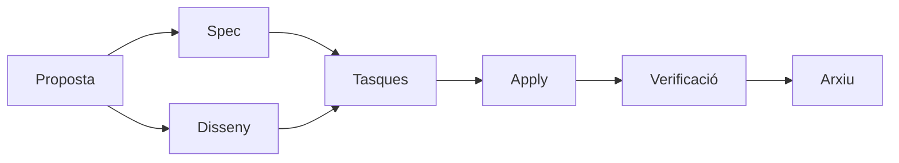
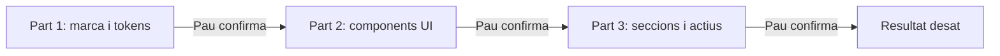

# Fases del flux SDD

> Referència ràpida de cada fase: què produeix, què consumeix i criteri de sortida.

## Diagrama de dependències


```mermaid
graph LR
    A[Proposta] --> B[Spec]
    A --> C[Disseny]
    B --> D[Tasques]
    C --> D
    D --> E[Apply]
    E --> F[Verificació]
    F --> G[Arxiu]
```

## Fases

### Proposta
- **Consumeix**: brief del client
- **Produeix**: abast, objectius, restriccions, no-goals
- **Criteri de sortida**: equip alineat en QUÈ es construeix

### Spec
- **Consumeix**: proposta aprovada
- **Produeix**: requisits funcionals i escenaris
- **Criteri de sortida**: tots els casos coberts

### Disseny
- **Consumeix**: proposta aprovada
- **Produeix**: decisions tècniques, arquitectura, components
- **Criteri de sortida**: cap pregunta tècnica oberta

### Tasques
- **Consumeix**: spec + disseny
- **Produeix**: checklist ordenada i implementable
- **Criteri de sortida**: cada tasca és atòmica i verificable

### Apply
- **Consumeix**: tasques + spec + disseny
- **Produeix**: codi implementat, tasques marcades
- **Criteri de sortida**: totes les tasques completades

### Verificació
- **Consumeix**: spec + tasques + apply-progress
- **Produeix**: informe de verificació (CRITICAL / WARNING / SUGGESTION)
- **Criteri de sortida**: sense CRITICAL oberts

### Arxiu
- **Consumeix**: tots els artefactes
- **Produeix**: informe final arxivat
- **Criteri de sortida**: canvi tancat i documentat

---

## INTAKE (landing)

!!! warning "En validació"
    Aquest INTAKE és la **proposta** (`SDD-VD/intake.proposta.md`) i encara es valida. La Part 1 no s'ha executat encara amb Qwen. La Part 2 és la v1: en la millor execució, 11 de 13 components han sortit correctes, però els resultats són inestables entre execucions. La Part 3 està definida a la proposta; aquesta pàgina no en recull resultats de prova.

INTAKE és la primera fase del flux de landings: converteix el disseny i la marca de VoraStudio en **dades estructurades i confirmades** abans d'escriure una línia d'HTML. Es fa en tres parts, i després de cada una l'agent **para i espera que Pau confirmi**.

Per al formulari de sessió actual, vegeu [INTAKE — Template de sessió](landing/intake.md). Les normes que envolten la fase són a [Normes del workflow](workflow/index.md).

### Visió general

| Part | Entrada | Què extreu | Eina |
|---|---|---|---|
| **1. Marca** | PDF de marca (amb text) | Colors, fonts i escala tipogràfica → `@theme` | `extract_pdf.py` |
| **2. Components UI** | PDF de components (només imatge) | Forma i colors de botons, formularis, etiquetes... | `render_pdf.py` (i `color_regions.py`) |
| **3. Seccions i actius** | Imatges de cada secció | Estructura de cada secció i checklist d'actius | Cap script |

Requisits: `pip install pypdf pymupdf`. Si falta una entrada, l'agent la demana i para.


```mermaid
graph LR
    P1[Part 1: marca i tokens] -->|Pau confirma| P2[Part 2: components UI]
    P2 -->|Pau confirma| P3[Part 3: seccions i actius]
    P3 -->|Pau confirma| R[Resultat desat]
```

### Part 1 — Colors, fonts i escala tipogràfica

**Què fa.** Transcriu els valors de marca escrits al PDF i els converteix en un bloc `@theme` de Tailwind v4.

**Per què.** Un model que "mira" un color a la imatge n'estima l'hex, i l'estimació pot fallar. Si el PDF té el valor escrit, es **llegeix**, no es calcula.

**Com funciona.**

1. Extracció del text amb l'script, no amb cap altra eina:

    ```bash
    python SDD-VD/scripts/extract_pdf.py <marca>.pdf
    ```

2. L'agent aplica sis regles:

    | Regla | Motiu |
    |---|---|
    | Transcriure els valors escrits; mai estimar un color o una font a partir de la imatge | Evitar valors inventats |
    | Creuar fonts d'informació (llista de tokens > fitxa del color) i comprovar que hex i RGB coincideixen | Detectar errors del propi PDF |
    | Si dos valors del mateix color o dues mides del mateix estil no coincideixen, llistar-los tots; no triar-ne cap en silenci | La decisió és de Pau |
    | Ignorar el contingut que no sigui de la marca del projecte | Evitar barrejar textos d'exemple |
    | Fonts: família i pesos tal com consten; pesos absents → "no especificat" | No inventar pesos |
    | Escala tipogràfica: per a cada rol, font i mida amb l'escala de Tailwind (aproximada); mai píxels ni valors arbitraris com `text-[22px]` | Mantenir el sistema de tokens |

3. Els tokens s'escriuen amb el prefix de Tailwind v4 (`--color-*`, `--font-*`), mantenint el nom del PDF darrere del prefix.

**Què presenta.** El `@theme` proposat (en línia, dins `<style type="text/tailwindcss">`), l'escala tipogràfica (rol → font i mida Tailwind) i les discrepàncies.

**Criteri de sortida.** Pau confirma els tokens.

#### Script `extract_pdf.py`

Extreu el text del PDF pàgina per pàgina. Requereix `pypdf`.

| Aspecte | Detall |
|---|---|
| Sortida | Text UTF-8 amb una capçalera `--- pN ---` per pàgina; les pàgines buides surten com `(sense text)` |
| Codi 0 | Correcte |
| Codi 1 | Fitxer no vàlid → missatge `ERROR_LECTURA` |
| Codi 2 | El PDF no té capa de text → missatge `SENSE_TEXT` |

Si l'ordre falla o retorna `SENSE_TEXT` o `ERROR_LECTURA`, l'agent ho diu a Pau i para. **No endevina els valors.**

### Part 2 — Components UI

**Què fa.** Descriu la forma (mida, padding, radi) i els colors dels components d'interfície: botons, formularis, etiquetes, estats.

**Per què.** El PDF de components no té capa de text, així que només es pot **veure**. Els colors d'una imatge no es poden llegir amb fiabilitat a ull, així que l'script els mesura per píxels i escriu el nom del token damunt de cada regió: l'agent llegeix una etiqueta en lloc d'estimar un hex.

**Com funciona.**

1. Es renderitzen les pàgines a imatge amb els colors confirmats a la Part 1, en format `nom=#HEX` sense el prefix `--color-`:

    ```bash
    python SDD-VD/scripts/render_pdf.py <components>.pdf <carpeta_sortida> --tokens purple-700=#5E35B1 ...
    ```

    L'agent mira cada imatge. Si no les pot veure, ho diu a Pau i para.

2. Per a cada component, en descriu la forma amb l'escala de Tailwind (mai píxels en text ni valors arbitraris: una cantonada de 30 px és `rounded-3xl`, no `rounded-[30px]`).
3. Els colors es descriuen **amb el nom del token de l'etiqueta**; no s'estima l'hex. Els `SENSE_TOKEN` s'avisen. Si una superfície no té etiqueta (per exemple una vora molt fina), es diu en lloc d'endevinar-la.
4. Les notes escrites a la imatge (vores, focus, cantonada...) porten valors exactes: es llegeixen tal com hi consten i s'assignen al component on apareixen. Si no es llegeixen bé o no és clar a quin component pertanyen, es marca i es pregunta.
5. S'ignoren els textos de plantilla o d'exemple que no siguin del projecte.
6. Els estats (hover, active, focus, disabled) que no consten ni al text ni a la imatge es marquen **"no especificat"**; no s'inventen.

**Què presenta.** Regles de components, amb els estats no especificats marcats.

**Criteri de sortida.** Pau confirma les regles de components.

!!! note "Limitació coneguda"
    Les etiquetes poden tapar una part del text de la imatge. Si una nota escrita no es llegeix bé, l'agent pregunta.

#### Script `render_pdf.py`

Renderitza cada pàgina del PDF a `pN.png` (a 144 dpi) dins de la carpeta indicada i n'imprimeix les rutes. Requereix `pymupdf`.

| Aspecte | Detall |
|---|---|
| Arguments | PDF, carpeta de sortida i, opcional, `--tokens nom=#HEX ...` |
| Sense `--tokens` | Només renderitza les pàgines |
| Amb `--tokens` | Escriu damunt de cada regió de color el token més proper, mesurat pels píxels |
| Colors que no s'assemblen a cap token | Etiqueta `SENSE_TOKEN #HEX` |
| Temps | Amb `--tokens` triga unes desenes de segons per pàgina |
| Codi 0 / 1 | Correcte / fitxer, carpeta o tokens no vàlids (`ERROR_RENDER`) |

L'etiqueta es col·loca a l'interior de les superfícies plenes i a sobre de les vores; si dues etiquetes se solapen, la segona es desplaça a la dreta.

#### Script `color_regions.py`

És el mòdul que `render_pdf.py` fa servir per detectar i assignar colors. També es pot executar sol, per depurar:

```bash
python SDD-VD/scripts/color_regions.py <components>.pdf --tokens nom=#HEX [nom=#HEX ...]
```

| Aspecte | Detall |
|---|---|
| Què detecta | Regions contigües de color (superfícies i vores); ignora el blanc |
| Com assigna el token | El més proper, si cap canal RGB difereix en més de 6; si no, `SENSE_TOKEN` |
| Regions petites | Es descarten les de menys de 300 px² a 72 dpi |
| Text | Queda fora: els glifs són massa petits |
| Sortida | Per pàgina, una línia per token amb el nombre de regions i fins a 8 caixes `[x0,y0,x1,y1]` en px a 72 dpi (`+N` si n'hi ha més) |
| Opció | `--dpi` (per defecte 72) |
| Codi 1 | Tokens o PDF no vàlids (`ERROR_COLORS`) |

### Part 3 — Seccions i actius

**Què fa.** Fa l'inventari del que cal construir i del que ja tenim.

**Per què.** Detectar abans de BUILD què falta (imatges, logo, fonts, textos) evita parar a mig bloc.

**Com funciona.**

1. Numera les seccions de les imatges en ordre i descriu l'estructura de cadascuna.
2. Per a cada imatge, logo, font i text necessari, indica si **hi és** o si **falta**.

**Què presenta.** Inventari de seccions i checklist d'actius (hi és / falta).

**Criteri de sortida.** Pau confirma l'inventari.

### Criteris de verificació d'INTAKE

| Comprovació | Criteri |
|---|---|
| Entrades | Les tres entrades existeixen; si no, l'agent para |
| Extracció de text | L'script torna codi 0; amb `SENSE_TEXT` o `ERROR_LECTURA` no s'avança |
| Valors | Tots vénen del PDF; cap color, font o mida estimats |
| Discrepàncies | Llistades totes, cap resolta en silenci |
| Notació | Cap píxel en text ni valor arbitrari (`text-[22px]`, `rounded-[30px]`) |
| Estats absents | Marcats "no especificat", no inventats |
| Aprovació | Pau ha confirmat cada part abans de passar a la següent |
| Resultat | Desat en un fitxer curt i estructurat, sense explicacions; BUILD el llegeix |
| Ordre | Cap `index.html` abans de la confirmació de les tres parts |

!!! note "Pendent"
    Falta executar la Part 1 amb Qwen i estabilitzar la Part 2 (11 de 13 components correctes en la millor execució, resultats inestables entre execucions).
