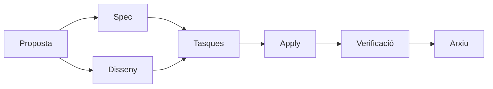
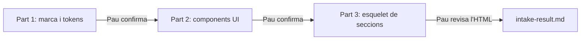

# Fases del flux SDD

> Referència ràpida de cada fase: què produeix, què consumeix i criteri de sortida.

## Diagrama de dependències


```mermaid
graph LR
    A[Proposta] --> B[Spec]
    A --> C[Disseny]
    B --> D[Tasques]
    C --> D
    D --> E[Apply]
    E --> F[Verificació]
    F --> G[Arxiu]
```

## Fases

### Proposta
- **Consumeix**: brief del client
- **Produeix**: abast, objectius, restriccions, no-goals
- **Criteri de sortida**: equip alineat en QUÈ es construeix

### Spec
- **Consumeix**: proposta aprovada
- **Produeix**: requisits funcionals i escenaris
- **Criteri de sortida**: tots els casos coberts

### Disseny
- **Consumeix**: proposta aprovada
- **Produeix**: decisions tècniques, arquitectura, components
- **Criteri de sortida**: cap pregunta tècnica oberta

### Tasques
- **Consumeix**: spec + disseny
- **Produeix**: checklist ordenada i implementable
- **Criteri de sortida**: cada tasca és atòmica i verificable

### Apply
- **Consumeix**: tasques + spec + disseny
- **Produeix**: codi implementat, tasques marcades
- **Criteri de sortida**: totes les tasques completades

### Verificació
- **Consumeix**: spec + tasques + apply-progress
- **Produeix**: informe de verificació (CRITICAL / WARNING / SUGGESTION)
- **Criteri de sortida**: sense CRITICAL oberts

### Arxiu
- **Consumeix**: tots els artefactes
- **Produeix**: informe final arxivat
- **Criteri de sortida**: canvi tancat i documentat

---

## INTAKE (landing)

!!! warning "En validació"
    Aquest INTAKE és la **proposta** (`SDD-VD/intake.proposta.md`) i encara es valida. Res d'aquesta pàgina és definitiu.

INTAKE és la primera fase del flux de landings: converteix el disseny i la marca de VoraStudio en **dades estructurades i confirmades** abans d'escriure una línia d'HTML. Es fa en tres parts, i després de cada una l'agent **para i espera que Pau confirmi**.

**Per què existeix.** Si el model construeix directament a partir d'imatges, "interpreta" el disseny: arrodoneix colors, inventa mides i omple buits amb valors per defecte. INTAKE separa **llegir** el disseny de **construir-lo**, i fa que cada valor que arriba a BUILD hagi passat per la confirmació de Pau.

Les normes que envolten la fase són a [Normes del workflow](workflow/index.md) i [Com estructurem AGENTS.md](workflow/agents-md.md).

### La idea clau: el que es pot mesurar, ho mesura un script

Un model de llenguatge **llegeix** bé els valors, però no és fiable quan ha de **comparar o mesurar**: pot aparellar colors pel nom, veure contradiccions que no existeixen, estimar mides a ull o confondre una vora fina amb un farciment. I no s'equivoca sempre igual, cosa que fa impossible corregir-ho amb més instruccions.

Per això la feina es reparteix:

| Qui | Què fa | Per què |
|---|---|---|
| **Scripts** (amb tests) | Llegir el PDF, mesurar colors i components, calcular discrepàncies | És determinista: dona el mateix resultat cada vegada |
| **Model** | Copiar el que diuen els scripts, llegir el que no es pot mesurar (color i pes del text), presentar-ho i parar | És el que fa bé: redactar i explicar |
| **Pau** | Decidir quan el manual es contradiu i confirmar cada part | La decisió no és del model |


```mermaid
graph LR
    P1[Part 1: marca i tokens] -->|Pau confirma| P2[Part 2: components UI]
    P2 -->|Pau confirma| P3[Part 3: esquelet de seccions]
    P3 -->|Pau revisa l'HTML| R[intake-result.md]
```

### Entrades

| Entrada | Què conté | Com es llegeix |
|---|---|---|
| `brand.pdf` | Colors, fonts i escala tipogràfica | Com a **text** (el PDF té capa de text) |
| `ui.pdf` | Components: botons, formularis, etiquetes, estats | Com a **imatge** (no té capa de text) |
| `design.pdf` | La landing sencera en una sola pàgina llarga | Tallada en seccions per un script: imatge + text |

Si falta una entrada, l'agent la demana i para. Totes viuen a `SDD-VD/sdd-local/`, que és fora de git: són dades de client. Requisits: `pip install pypdf pymupdf`.

---

### Part 1 — Colors, fonts i escala tipogràfica

**Què fa.** Converteix el manual de marca en un bloc `@theme` de Tailwind v4, amb la tipografia i les discrepàncies del manual.

**Com funciona.** L'agent executa dues ordres, i cap altra eina per llegir el PDF:

```bash
python SDD-VD/scripts/brand_cards.py SDD-VD/sdd-local/brand/brand.pdf   # colors
python SDD-VD/scripts/extract_pdf.py SDD-VD/sdd-local/brand/brand.pdf   # fonts i escala
```

| Pas | Què fa l'agent | Per què |
|---|---|---|
| Colors | Copia la taula, els tokens i els avisos de `brand_cards.py`; no recalcula ni compara | La comparació la fa l'script, que dona sempre el mateix resultat |
| `@theme` | Un token per cada variable del manual, amb l'etiqueta del PDF com a comentari (`/* MORAT VIU */`) | L'etiqueta permet traduir després notes com "focus en morat viu" |
| Colors sense token | No entren al `@theme`; es llisten a part | No es pot inventar un nom de token |
| Fonts | Família i pesos **tal com estan escrits**, errates incloses; sense pesos → "no especificat" | Corregir una errata o afegir un Regular per defecte és canviar el que diu el client sense que ho sàpiga |
| Rols i escala | Només si el PDF els escriu; si no, "no consta" | Si el PDF no diu quina font és per a títols, afirmar-ho seria inventar |
| Discrepàncies | Es llisten totes; no se'n tria cap | Decideix Pau |

**Què presenta.** El `@theme` en línia, fonts i pesos, l'escala o "no consta", els avisos de color copiats i les discrepàncies de tipografia. **Para.**

#### Script `brand_cards.py`

Llegeix les **targetes de color** del manual (rectangles de color amb el nom i els valors a dins) i les compara de manera determinista.

**Per què agrupa per targeta i no llegeix el text en ordre.** Quan una targeta és alta, el nom queda a dalt i els valors molt més avall. Llegit en ordre, els valors poden quedar sense nom i el model n'hauria d'endevinar el propietari. L'script assigna cada línia de text al rectangle que la conté.

| Aspecte | Detall |
|---|---|
| Per targeta | Nom, HEX, RGB, CMYK i **color real** del rectangle |
| Tokens | Llegeix les variables (`--nom #HEX`) i la seva etiqueta |
| Avisos que calcula | HEX ≠ RGB · HEX o RGB ≠ color real · valor malmès · mateix HEX a dues targetes · mateix nom amb HEX diferents · mateix HEX amb noms diferents · color sense token · token sense targeta |
| Regla de creuament | Sempre pel HEX, mai pel nom: un manual pot fer servir el mateix nom per a colors diferents en pàgines diferents |
| Sense targetes | `SENSE_TARGETES` i codi 2: l'agent para, no treu els colors a mà |
| Codis | 0 correcte · 1 `ERROR_LECTURA` · 2 `SENSE_TARGETES` |

#### Script `extract_pdf.py`

Extreu el text del PDF pàgina per pàgina (`pypdf`). A la Part 1 només s'usa per a fonts i escala.

| Codi | Significat |
|---|---|
| 0 | Correcte (una capçalera `--- pN ---` per pàgina) |
| 1 | Fitxer no vàlid → `ERROR_LECTURA` |
| 2 | El PDF no té capa de text → `SENSE_TEXT` (l'agent para) |

---

### Part 2 — Components UI

**Què fa.** Descriu cada component (botons, formularis, targetes, etiquetes, pestanyes) de manera que BUILD el pugui reproduir **fidel a l'original**: forma, farciment, vora, text i mida.

**Per què necessita scripts.** El PDF de components és una imatge. Mirant-la, un model pot encertar colors grans i radis, però no mesura: una diferència de pocs píxels en l'alçada d'un botó o una vora de mig píxel es perden a ull. Construït així, el resultat es veuria diferent del disseny.

**Com funciona.**

```bash
python SDD-VD/scripts/render_pdf.py SDD-VD/sdd-local/brand/ui.pdf SDD-VD/sdd-local/brand/ui-pages --tokens nom=#HEX ...
python SDD-VD/scripts/ui_metrics.py SDD-VD/sdd-local/brand/ui.pdf --tokens nom=#HEX ...
```

Els tokens són els que Pau ha confirmat a la Part 1.

| Pas | Què fa l'agent | Per què |
|---|---|---|
| Mirar les imatges | Cada component porta una etiqueta amb un ID (`C3`) i el seu token | Per saber quin component és cada línia de mesures |
| Forma, farciment, vora i mida | Les **copia** de la línia de `ui_metrics.py` amb el mateix ID; si hi ha dues classes (`h-10/h-11`), les dues | Són mesures, no s'estimen a ull |
| Text | Color, pes i majúscules, llegits de la imatge | És l'únic que no es mesura |
| Hex | Només els de `ui_metrics.py`, mai els de les etiquetes de la imatge | Les etiquetes de la imatge són petites i es poden llegir malament; la sortida de text no |
| Notes escrites | S'assignen al component on apareixen; els colors pel nom es tradueixen amb l'etiqueta del `@theme` | "Morat viu" ha de ser el token amb aquesta etiqueta |
| Nota vs mesura | Si no coincideixen, es llisten tots dos | Un manual es pot contradir (una nota diu un radi i el dibuix en fa un altre); decideix Pau |
| Estats | Hover, active, focus o disabled que no consten → "no especificat" | No s'inventen |
| Textos | Els textos d'exemple dels components no cal transcriure'ls; s'ignoren només els aliens a la marca | El nom de la marca és el del client, no el de VoraData: no és motiu per ignorar res |

No es retallen ni es desen altres imatges: només les que genera `render_pdf.py`.

**Què presenta.** Una fitxa per component amb el seu ID, els avisos de color sense token, les discrepàncies i els estats no especificats. **Para.**

#### Script `ui_metrics.py`

Mesura cada component de les pàgines renderitzades i en dona una línia de text:

```text
C4 · x 315 y 344 · 194×43 (w-48/w-49 · h-11) · farciment cap · vora 1.5 purple-700 (border/border-2) · radi full (rounded-full)
```

| Aspecte | Detall |
|---|---|
| Unitats | Píxels del disseny (el PDF es renderitza a 144 dpi, el doble) |
| Farciment i vora | Token més proper o `SENSE_TOKEN #HEX`; una vora grisa es reporta com a vora, no com a farciment |
| Gruix de vora | Mesurat amb la cobertura parcial dels píxels, per no perdre les vores de 0,5-1 px |
| Radi | Ajustat a la corba de la cantonada; `full` si és una píndola |
| Classes | Escala de Tailwind v4, mai valors arbitraris; si la mida cau entre dues classes, dona les dues |
| Niuament | `dins C2` si el component és dins d'un altre (per exemple, els camps dins del formulari) |
| IDs | Globals entre pàgines (C1…Cn), els mateixos que surten a la imatge |
| Codis | 0 correcte · 1 `ERROR_METRIQUES` · 2 `SENSE_COMPONENTS` |

**Limitació.** Si la imatge mateixa és ambigua (per exemple, una vora amb un gris diferent a cada costat), la mesura també ho és: l'script dona el gris sense token i la classe (`border`), però no un hex exacte.

#### Script `render_pdf.py`

Renderitza cada pàgina a `pN.png` (144 dpi). Amb `--tokens`, escriu damunt de cada regió de color el seu token i, si forma part d'un component, l'ID de `ui_metrics.py` (`C3 purple-700`). Les etiquetes poden tapar una part del text: si una nota no es llegeix bé, l'agent pregunta. Codis: 0 correcte · 1 `ERROR_RENDER`.

`color_regions.py` és el mòdul de base que detecta regions de color i les assigna al token més proper (cap canal RGB a més de 6 de diferència). També es pot executar sol per depurar.

#### Tests

Els scripts `brand_cards.py`, `ui_metrics.py` i `split_sections.py` tenen tests (`unittest`) amb PDF sintètics, sense dades de client.

```bash
cd SDD-VD/scripts && python -m unittest
```

---

### Part 3 — Esquelet de seccions

**Què fa.** Talla el disseny en seccions i construeix un **esquelet HTML**: una `<section>` per secció, amb els textos reals, els colors i components confirmats a les Parts 1 i 2 i un placeholder a cada imatge. BUILD parteix d'aquest esquelet.

**Per què.** Amb l'esquelet, Pau veu al navegador si l'estructura és la del disseny (ordre, columnes, quins elements hi ha) abans de posar-hi detall. Un error d'estructura detectat aquí no obliga a desfer blocs acabats.

**Com funciona.**

```bash
python SDD-VD/scripts/split_sections.py SDD-VD/sdd-local/brand/design.pdf SDD-VD/sdd-local/sections --tokens nom=#HEX ...
```

| Pas | Què fa | Per què |
|---|---|---|
| Tallar | L'**script** crea `S1.png`, `S2.png`... i l'arbre de disposició de cada secció | On comença i acaba una secció es calcula, no s'endevina |
| Llegir | El model mira les seccions **una a una** i en fa una fitxa: nom i el que només es veu a la imatge (icones, un menú) | Amb totes alhora barreja elements entre seccions |
| Disposició | El model **copia** l'arbre: `pt`/`pb`, `mt` entre elements, columnes en dotzens, `gap-x` | A ull, un model centra blocs, inventa marges i desplaça elements desenes de píxels |
| Construir | `SDD-VD/sdd-local/skeleton/index.html`, una `<section id="sN">` per secció amb `min-h-dvh` | `min-h-dvh` i no `h-screen`: si el contingut no hi cap (mòbil), creix en lloc de desbordar; `dvh` descompta la barra del navegador a iOS |
| Textos | Literals de la sortida de l'script, errates incloses; mida, la classe que dona l'script | El text és del client |
| Colors | Només tokens del `@theme`; un color `SENSE_TOKEN` fa servir el token més proper i s'avisa | Cap hex nou entra a l'HTML sense que Pau ho sàpiga |
| Imatges | `<div class="bg-[#d9d9d9] aspect-[w/h]">` amb la proporció de l'script | Són els **únics** valors arbitraris permesos: el placeholder ha d'ocupar el mateix espai que la imatge |
| Botons i camps | Les classes del component de la Part 2 que s'hi assembla, o "estimat" | L'estil ja està confirmat; no es torna a interpretar |
| Mobile-first | Base d'una columna; la disposició del disseny va amb `md:` | Norma del preset |

**Què presenta.** Les fitxes, els avisos (colors sense token i el token usat, components estimats, fonts que no són al `@theme`) i la ruta de l'HTML. **Para: Pau revisa l'esquelet al navegador.** Aquesta part no té parada intermèdia: la comprovació és sobre l'HTML.

#### Script `split_sections.py`

Ha de servir per a **qualsevol disseny**, no només per al format d'una eina. Per això busca les seccions per capes, de la més fiable a la més bàsica, i mesura sobre el que **es veu**:

| Aspecte | Detall |
|---|---|
| Talls | 1) `--cuts` donats per Pau · 2) una secció per pàgina · 3) fons vectorials de l'amplada de la pàgina que la cobreixen sense forats · 4) píxels: on canvia el color dels marges (dues seccions seguides del mateix color surten juntes) |
| Elements | De la capa de text i els dibuixos del PDF si en té; si no, dels píxels (XY-cut sobre el que no és fons) |
| Disposició | XY-cut: files de dalt a baix, columnes dins de cada fila, i el que hi ha dins de cada caixa o imatge |
| Distàncies | `pt`, `pb`, `mt`, `gap-x` i `pl` a l'escala de Tailwind; si cau entre dues classes, dona les dues |
| Horitzontal | `centrat`, o la `x` d'inici i l'amplada en dotzens |
| Textos | Línies del mateix estil unides en blocs; classe de mida i interlineat (`leading-*`) |
| Colors | **Mesurats als píxels**: el fons (marges de la secció), les caixes i el text. Un programa de disseny pot deixar capes invisibles o màscares amb un altre color |
| Radis | Mesurats a la cantonada dels píxels: cada eina arrodoneix d'una manera (corbes, retalls) |
| Màscares | Una "caixa" amb l'interior no uniforme és una màscara: si és dins d'una imatge, en marca l'àrea visible |
| Imatges | Proporció per al placeholder; "de fons" si cobreix la secció; "tallada pel marge" (carrusel); "travessa el tall" (una sola imatge entre dues seccions) |
| Text sobre una foto | "sobre imatge": la mesura no és fiable; el model el llegeix de la imatge |
| Llindars | Proporcionals a l'amplada del disseny, no ajustats a un PDF concret |
| Codis | 0 correcte · 1 `ERROR_LECTURA` · 2 `SENSE_SECCIONS` (l'agent demana els talls a Pau) |

---

### Criteris de verificació d'INTAKE

| Comprovació | Criteri |
|---|---|
| Entrades | Existeixen totes; si no, l'agent para |
| Eines | Només les ordres del flux; cap lectura alternativa del PDF ni fitxers propis |
| Valors | Venen dels scripts o del PDF; cap color, font o mida estimats a ull |
| Discrepàncies | Llistades totes, cap resolta en silenci |
| Notació | Cap píxel en text ni valor arbitrari (`text-[22px]`, `rounded-[30px]`); només els placeholders d'imatge (`bg-[#d9d9d9] aspect-[w/h]`) |
| Estats absents | "no especificat", no inventats |
| Aprovació | Pau confirma cada part abans de la següent |
| Esquelet | Una `<section>` per secció, en ordre; només tokens del `@theme`; textos literals; cap `<script>` ni `<style>` propis |
| Resultat | `intake-result.md`, curt i estructurat, i l'esquelet; BUILD parteix de tots dos |
| Ordre | L'esquelet viu a `sdd-local/skeleton/`; cap `index.html` definitiu abans de les tres confirmacions |

!!! note "Pendent"
    - Els scripts llegeixen manuals amb targetes de color i components dibuixats; un format diferent pot necessitar ampliar-los.
    - Definir què es desa exactament a `intake-result.md`.
