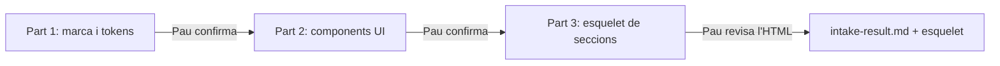

# INTAKE — Com es prepara i s'executa

> INTAKE converteix els fitxers que envia VoraStudio en dades confirmades i en un esquelet HTML, abans de construir res. Ja no s'omple cap formulari a mà: els valors surten dels PDF, mesurats per scripts.

!!! warning "En validació"
    Aquest és el flux de la **proposta** (`SDD-VD/intake.proposta.md`). El detall de cada part, amb el per què de cada pas, és a [Fases → INTAKE](../fases.md#intake-landing).

---

## 1. Què ha d'arribar

Els fitxers del client van a `SDD-VD/sdd-local/brand/`, que és **fora de git**: són dades de client i el repositori és públic.

| Fitxer | Què és | Part que el fa servir |
|---|---|---|
| `brand.pdf` | Manual de marca: colors, fonts, escala tipogràfica | Part 1 |
| `ui.pdf` | Components: botons, formularis, etiquetes, estats | Part 2 |
| `design.pdf` | La landing sencera, en una pàgina llarga o una pàgina per secció | Part 3 |

Si en falta un, l'agent el demana i para.

Els projectes de VoraStudio també porten `fonts/`, `logos/` i vídeos. Encara no entren al flux (vegeu *Pendent*).

## 2. Com s'arrenca

Obre OpenCode a l'arrel del repositori i demana la fase:

```text
Fase INTAKE de la landing. Llegeix SDD-VD/intake.proposta.md i executa la Part 1.
```

L'agent fa **una part cada vegada** i para. Quan confirmes, li demanes la següent.

## 3. Les tres parts



| Part | Script | Què surt | Què fas tu |
|---|---|---|---|
| 1 · Marca | `brand_cards.py` + `extract_pdf.py` | El `@theme` (colors i fonts), els pesos tal com estan escrits i els avisos del manual | Decidir cada contradicció del manual i confirmar el `@theme` |
| 2 · Components | `render_pdf.py` + `ui_metrics.py` | Una fitxa per component (mida, farciment, vora, radi) amb classes de Tailwind | Decidir quan una nota diu una mida i el dibuix una altra |
| 3 · Esquelet | `split_sections.py` | `sdd-local/skeleton/index.html`: una `<section>` per secció amb textos reals, tokens i placeholders | Revisar-lo al navegador |

**La regla de fons:** el que es pot mesurar (colors, mides, distàncies) ho mesura un script amb tests. El model només copia la sortida i la presenta; no estima res a ull.

## 4. Part 3: com es talla i es mesura el disseny

`split_sections.py` serveix per a qualsevol origen (Canva, Figma, un PDF aplanat):

| Com arriba el disseny | Com es talla |
|---|---|
| Diverses pàgines | Cada pàgina és una secció |
| Una pàgina llarga amb vectors | Pels fons de l'amplada de la pàgina |
| Una pàgina aplanada (imatge) | Pels píxels: on canvia el color dels marges |
| Res de l'anterior funciona | `SENSE_SECCIONS`: Pau dona les altures dels talls amb `--cuts` |

De cada secció en treu l'**arbre de disposició**, i el model el copia a l'HTML:

```text
S1 · 1440×800 · fons imatge de fons · placeholder bg-[#d9d9d9]
  pt-12 (48) · pb-24 (96)
  caixa · 220×40 (w-55 · h-10) · #FFFFFF paper · rounded-full · centrat
  ↓ mt-40 (160)
  text · Serif-Regular 44.0 (text-5xl) · 2 línies · leading-none · "Títol de l'hero" / "en dues línies" · centrat
```

- **Distàncies:** `pt`, `pb`, `mt` i `gap-x` com a classes de Tailwind.
- **Columnes:** amplades en dotzens (`md:col-span-N`).
- **Textos:** literals, amb la classe de mida i l'interlineat.
- **Colors i radis:** els que **es veuen**, mesurats als píxels. Si un color no és cap token, surt `SENSE_TOKEN` amb el més proper.
- **Imatges:** proporció per al placeholder; avís si és un carrusel (tallada pel marge) o si travessa dues seccions.

Cada secció fa com a mínim una pantalla (`min-h-dvh`).

## 5. Què queda al final

- `SDD-VD/sdd-local/intake-result.md`: el `@theme`, les regles de components i les decisions de Pau.
- `SDD-VD/sdd-local/skeleton/index.html`: l'esquelet del qual parteix BUILD.

Cap `index.html` definitiu abans que Pau confirmi les tres parts.

!!! note "Pendent"
    - Fonts i logos com a entrades: comprovar que hi ha els fitxers que demana el disseny.
    - El contingut exacte d'`intake-result.md`.
    - Flux SaaS: sense definir.
