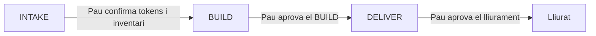

# Normes del workflow SDD

> Les regles amb què l'agent treballa una landing, fase a fase: què llegeix, quan para i qui aprova.

!!! warning "En validació"
    Aquest workflow és una **proposta** i encara es valida. Res d'això és definitiu.

## Idea principal

L'agent **no decideix ni encadena fases pel seu compte**. Segueix un ordre fix, llegeix només els fitxers de la fase actual i s'atura a cada punt d'aprovació perquè Pau confirmi.

## Les 6 normes

| # | Norma | Per què existeix |
|---|---|---|
| 1 | Confirmar tipus de projecte i fase **abans de llegir res** | Un model que llegeix tot "per si de cas" gasta context i barreja instruccions de fases diferents. |
| 2 | Ordre fix: INTAKE → BUILD → DELIVER | Cada fase produeix l'entrada de la següent. Saltar-se'n una vol dir construir sobre supòsits. |
| 3 | Cap pas a la fase següent sense l'aprovació de Pau | *Human on the loop*: l'agent executa, l'equip dirigeix i verifica. |
| 4 | Llegir només els fitxers de la fase actual | Menys context significa menys errors i respostes més enfocades. |
| 5 | Si falta informació, **preguntar i parar**; mai endevinar | Un valor inventat (un hex, una mida) es propaga a tot el projecte i costa car de detectar. |
| 6 | El resultat de cada fase es desa en un fitxer curt | La fase següent llegeix aquest fitxer, no la conversa. Els artefactes són la font de veritat. |

## Què llegeix i què fa cada fase

| Fase | Quan comença | Llegeix | Acaba quan |
|---|---|---|---|
| **INTAKE** | Arriba un projecte nou amb disseny i marca, i encara no hi ha tokens confirmats | `docs/sdd/landing/intake.md` + `docs/presets/landing/design-system.md` | Pau confirma els tokens i l'inventari |
| **BUILD** | Els tokens estan confirmats i cal escriure HTML | `docs/presets/landing/componentes.md` + `docs/presets/landing/normas.md` (i `recursos.md` si calen UI, animació, icones o imatges) | Pau aprova el BUILD |
| **DELIVER** | Pau ha aprovat el BUILD | `docs/normes/lliurament.md` | Pau aprova el lliurament |

!!! info "Detall d'INTAKE"
    Què fa cada part d'INTAKE i com s'usen els scripts: [Fases del flux SDD](../fases.md#intake-landing).

## Normes d'INTAKE

- **Les entrades són fixes**: PDF de marca, PDF de components UI i imatges de cada secció. Si en falta alguna, l'agent la demana i para.
- **No s'escriu `index.html` fins que Pau ha confirmat les tres parts** d'INTAKE.
- **El resultat** es desa en un fitxer curt i estructurat, sense explicacions. BUILD el llegeix.
- **Les entrades del client no entren al repositori** (LOPD): viuen en una carpeta local exclosa amb `.gitignore`.

## Normes de BUILD

- Es construeix per **blocs majors** (hero, cos, peu) amb un punt d'aturada humà després de cada bloc.
- El disseny de VoraStudio es reprodueix **sense reinterpretar-lo**. Si falta informació, es pregunta.

!!! note "Pendent"
    El **protocol HITL** (format exacte de la frase de parada i del log de cada bloc) està només esbossat a la proposta. Falta definir-lo abans de poder documentar-lo.

## Qui decideix què

| Àmbit | Decideix |
|---|---|
| IA, flux i agent | Pau |
| Backend i SaaS | Carles |
| Disseny | VoraStudio (l'agent el reprodueix) |

L'agent executa i proposa; no decideix. Si Pau s'equivoca, li ho diu amb evidència.

## Persistència

Mode **hybrid**: Engram (memòria entre sessions) i OpenSpec (fitxers a git). Detall a [Engram](../../ia/mcp/engram.md) i [OpenSpec](../../ia/mcp/openspec.md).

## Decisions obertes

| # | Pregunta |
|---|---|
| 1 | El registre de skills (~24 KB): es carrega sencer o només l'índex de cada fase? |
| 2 | El router s'ha de validar amb un benchmark: el log ha de mostrar que el model llegeix els fitxers correctes a cada fase. |
| 3 | El fitxer `design.md` (~9 KB) es manté sencer o es parteix per fase? |
| 4 | El flux SaaS es defineix abans o es deixa com a "pendent" al router? |

## Següent pas

Com es tradueixen aquestes normes en el fitxer que l'agent llegeix primer: [Com estructurem AGENTS.md](agents-md.md).
